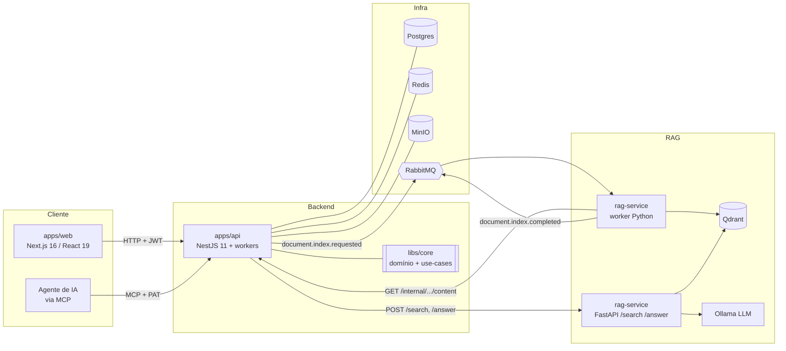

<div align="center">

# 🦄 my-little-pony

**Plataforma de autoria e publicação de documentos com busca semântica e RAG generativo.**

Escreva documentos num editor rico, publique páginas públicas, importe arquivos e converse com o seu próprio acervo através de IA.

[](https://nx.dev)
[](https://nestjs.com)
[](https://nextjs.org)
[](https://fastapi.tiangolo.com)
[](#-licença)

</div>

---

## 📑 Sumário

- [O que é](#-o-que-é)
- [Funcionalidades](#-funcionalidades)
- [Telas & fluxos](#-telas--fluxos)
- [Arquitetura](#-arquitetura)
- [Stack tecnológico](#-stack-tecnológico)
- [Como rodar](#-como-rodar)
- [Estrutura de pastas](#-estrutura-de-pastas)
- [Comandos úteis](#-comandos-úteis)
- [Variáveis de ambiente](#-variáveis-de-ambiente)
- [Como contribuir](#-como-contribuir)
- [Licença](#-licença)

---

## 🎯 O que é

**my-little-pony** (`mlp`) é uma aplicação web onde um usuário autenticado:

1. **Escreve** documentos num editor rico (Tiptap) com autosave, configuração de página (papel, margens, tema) e imagens.
2. **Publica** esses documentos como páginas públicas com URL própria e download em PDF.
3. **Importa** arquivos-fonte (PDF, DOCX, MD, HTML) para formar uma base de conhecimento.
4. **Busca** semanticamente e **pergunta em linguagem natural** ("Explorar") sobre todo o seu acervo — respostas geradas por IA **ancoradas nas fontes** (RAG), com anti-alucinação.
5. **Recebe mensagens** de visitantes das páginas publicadas ("Fale com a gente").

Tudo é **multi-tenant** (isolado por `ownerId`) e a mesma API é exposta a **agentes de IA** via um servidor **MCP** (Model Context Protocol) autenticado por tokens de acesso pessoais.

> A interface e as mensagens são em **português (BR)**.

---

## ✨ Funcionalidades

| Área | O que faz |
|------|-----------|
| **Contas & sessão** | Registro, login, logout. Access token JWT curto + refresh token opaco em cookie `httpOnly`. Senhas com Argon2id. |
| **Editor de documentos** | Editor Tiptap com autosave versionado (concorrência otimista), toolbar, fontes, imagens redimensionáveis, categorias e configuração de página (orientação, margens, cor de fundo, tema). |
| **Publicação** | Publicar gera slug único e página pública em `/d/:ownerId/:slug` (com cache Redis). Despublicar volta a rascunho. |
| **PDF** | No publish, um worker renderiza o HTML em PDF (Puppeteer). A página pública oferece download e "receber por e-mail". |
| **Arquivos-fonte** | Upload de PDF/DOCX/DOC/MD/HTML (até 25 MB) para busca/RAG. |
| **Busca semântica** | Busca no conteúdo de documentos e arquivos, via serviço Python. |
| **Explorar (RAG)** | Pergunta em linguagem natural respondida por LLM local, ancorada nas fontes, com indicador *grounded* e lista de fontes citadas. |
| **Mensagens** | Visitantes anônimos enviam contato num documento publicado; o autor lê na sua caixa de entrada. |
| **Perfil & avatar** | Atualizar nome/e-mail/avatar, trocar senha (revoga sessões). |
| **Tokens & MCP** | Personal Access Tokens com escopos (`documents:read/write/publish`, `messages:*`, …) que autenticam o endpoint MCP para agentes de IA. |

---

## 🖥️ Telas & fluxos

> Não há screenshots versionadas ainda — as telas estão descritas por rota. Mockups de referência ficam em [`docs/mockups/`](docs/mockups/) e o design system em [`docs/design-system.md`](docs/design-system.md).

**Área pública / autenticação**

| Rota | Tela |
|------|------|
| `/` | Login (layout split: painel de apresentação + formulário) |
| `/d/:ownerId/:slug` | Página pública de um documento publicado (leitura anônima, download de PDF, "Fale com a gente") |

**Área autenticada (`/app/*`)**

| Rota | Tela |
|------|------|
| `/app` | Lista de documentos (busca/filtros) |
| `/app/editor` | Editor de documento (Tiptap + configuração de página) |
| `/app/arquivos` | Importação e gestão de arquivos-fonte |
| `/app/explorar` | Explorar — perguntas em linguagem natural (RAG) |
| `/app/mensagens` | Caixa de entrada de mensagens de contato |
| `/app/config` | Perfil, avatar, senha e tokens de acesso |

---

## 🏗️ Arquitetura

Arquitetura **hexagonal (ports & adapters)** tanto na API (TypeScript) quanto no serviço de RAG (Python). A regra de negócio vive isolada em [`libs/core`](libs/core/), agnóstica de framework — os apps só fornecem os *adapters* (Postgres, Redis, RabbitMQ, MinIO, HTTP…).



**Fluxo de indexação (resumido):**

1. Ao **publicar** um documento ou **importar** um arquivo, a API publica `document.index.requested` no RabbitMQ.
2. O **worker Python** consome o evento, busca o conteúdo de volta pela API interna (`GET /internal/documents/:id/content`, protegida por token de serviço), faz *chunking* (Docling) + *embeddings* (BGE) e **indexa no Qdrant**.
3. O worker publica `document.index.completed`; a API projeta o status (`indexing → ready/failed`).
4. **Busca / Explorar**: a API faz proxy para o FastAPI, que recupera do Qdrant (denso + esparso + rerank) e, para respostas, gera texto via **Ollama** ancorado nas fontes.

### Componentes

| Componente | Responsabilidade | Stack |
|-----------|------------------|-------|
| [`apps/api`](apps/api/) | API HTTP + servidor MCP + workers (PDF, indexação) | NestJS 11, TypeORM, ioredis, amqplib, Puppeteer |
| [`apps/web`](apps/web/) | Frontend (App Router) | Next.js 16, React 19, Tiptap |
| [`apps/rag-service`](apps/rag-service/) | Indexação + busca híbrida + RAG generativo | Python, FastAPI, Qdrant, Ollama |
| [`libs/core`](libs/core/) | Domínio, use-cases e *ports* (sem framework) | TypeScript puro, Vitest |
| [`packages/contracts`](packages/contracts/) | DTOs compartilhados web/api | TypeScript *(stub, a evoluir)* |

<details>
<summary><b>Módulos da API (NestJS)</b></summary>

`config` · `persistence` (TypeORM/Postgres) · `redis` · `rate-limit` · `messaging` (RabbitMQ + consumers) · `security` · `storage` (MinIO) · `pdf` (Puppeteer) · `mail` (nodemailer) · `auth` · `users` · `documents` · `public` · `search` · `explore` · `internal` · `messages` · `source-files` · `personal-access-tokens` · `mcp` · `health`

</details>

---

## 🧰 Stack tecnológico

| Camada | Tecnologias |
|--------|-------------|
| **Frontend** | Next.js 16, React 19, App Router, Tiptap, Zustand |
| **Backend** | NestJS 11, TypeScript, TypeORM + Postgres 16, JWT + Argon2, `@nestjs/throttler` + Redis, amqplib, MinIO, nodemailer, Puppeteer, Zod, `@modelcontextprotocol/sdk` |
| **Domínio** | TypeScript puro (`libs/core`), hexagonal |
| **RAG** | Python, FastAPI, Docling, embeddings BGE-M3, BM25, reranker BGE, Qdrant, Ollama |
| **Infra (dev)** | Docker Compose: Postgres, Redis, RabbitMQ, MinIO, Mailpit, Qdrant, Ollama |
| **Tooling** | Nx 23, pnpm 10, Biome (lint/format), Husky + commitlint, Vitest |

---

## 🚀 Como rodar

### ⚡ Opção A — Tudo no Docker (recomendado)

O jeito mais fácil: **um comando sobe a aplicação inteira** (banco, fila, storage, e-mail, API e Web). Não precisa instalar Node, pnpm nem nada além do Docker.

**Pré-requisito:** apenas **[Docker](https://docs.docker.com/get-docker/) + Docker Compose**.

```bash
docker compose up -d --build
```

Aguarde os containers ficarem saudáveis (`docker compose ps`) e abra 👉 **http://localhost:3000** 🎉

Isso sobe 7 containers definidos em [`docker-compose.yml`](docker-compose.yml). Portas no host usam **offset `+10`** para coexistir com outros stacks locais:

| Container | Papel | Porta (host) | UI / credenciais |
|-----------|-------|:---:|------------------|
| **web** | Frontend Next.js | `3000` | http://localhost:3000 |
| **api** | Backend NestJS + MCP | `3333` | Swagger: http://localhost:3333/docs |
| **postgres** | Banco de dados | `5442` | `mlp` / `mlp` / db `mlp` |
| **redis** | Cache + sessões | `6389` | — |
| **rabbitmq** | Fila de eventos | `5682` / `15682` | painel: http://localhost:15682 (`guest`/`guest`) |
| **minio** | Object storage | `9010` / `9011` | console: http://localhost:9011 (`mlp`/`mlpsecret123`) |
| **mailpit** | Captura de e-mails (dev) | `1025` / `8025` | inbox: http://localhost:8025 |

> Os **segredos de dev** (JWT, tokens) já vêm embutidos no compose — zero configuração. Em produção, sobrescreva-os (veja [Variáveis de ambiente](#-variáveis-de-ambiente)).

> ⏱️ A **primeira** subida compila as imagens e instala dependências (alguns minutos). As próximas usam cache e sobem em segundos.

#### Ligar a busca / RAG (opcional, pesado)

As telas **Busca** e **Explorar** dependem do serviço de IA (Python + Qdrant + Ollama) — imagens grandes e modelos de vários GB. Elas ficam num **profile** separado para não pesar o dia a dia. Sem elas, o resto da app funciona normalmente (a busca degrada graciosamente).

```bash
# sobe TAMBÉM o RAG (worker, api Python, Qdrant, Ollama)
MLP_SEARCH_SERVICE_URL=http://rag-api:8000 docker compose --profile rag up -d --build

# baixe o modelo do LLM uma vez (fica no volume):
docker compose --profile rag exec ollama ollama pull qwen2.5:7b-instruct
```

> 🖥️ Roda em **CPU** por padrão. Com GPU NVIDIA, descomente o bloco `deploy:` do serviço `ollama` no [`docker-compose.yml`](docker-compose.yml) e ajuste `RAG_DEVICE=cuda`.

#### Gerenciando os containers

```bash
docker compose ps                 # status + saúde
docker compose logs -f api        # acompanhar logs de um serviço
docker compose stop               # parar sem apagar dados
docker compose down               # remover containers (mantém volumes/dados)
docker compose down -v            # ⚠️ remove TAMBÉM os dados (banco/storage) — começa do zero
```

> Os dados persistem nos volumes `mlp_pg`, `mlp_minio`, `mlp_qdrant`, `mlp_ollama`.

---

### 🧑‍💻 Opção B — Apps no host (dev com hot-reload)

Melhor para desenvolver: infra em Docker, mas API e Web rodando localmente com recarga instantânea.

**Pré-requisitos:** Docker + **Node.js 22** + **pnpm 10** (`corepack enable && corepack prepare pnpm@10.33.0 --activate`).

```bash
# 1. só a infra (sem api/web)
docker compose up -d postgres redis rabbitmq minio mailpit

# 2. configure os .env
cp .env.example .env
cp apps/web/.env.example apps/web/.env
#   gere os segredos obrigatórios (rode 1x para cada: JWT_ACCESS_SECRET,
#   JWT_REFRESH_SECRET, INTERNAL_API_TOKEN) e cole no .env:
node -e "console.log(require('crypto').randomBytes(32).toString('hex'))"

# 3. dependências + apps (dois terminais)
pnpm install
pnpm nx serve @my-little-pony/api    # API  → http://localhost:3333
pnpm dev                             # Web  → http://localhost:3000
```

> No `.env` da raiz, as portas de infra usam o **offset `+10`** (ex.: `DATABASE_URL=...@localhost:5442`), pois aqui a app roda fora da rede do Docker. Para o RAG em dev, veja [`apps/rag-service/README.md`](apps/rag-service/README.md).

---

## 📁 Estrutura de pastas

```
mlq/
├─ apps/
│  ├─ api/          # NestJS — HTTP + MCP + workers
│  ├─ web/          # Next.js 16 / React 19 (App Router)
│  └─ rag-service/  # Python — worker RabbitMQ + FastAPI (search/answer)
├─ libs/
│  └─ core/         # Domínio + use-cases + ports (framework-free)
├─ packages/
│  └─ contracts/    # DTOs compartilhados (stub)
├─ docs/            # design-system.md + mockups HTML
├─ docker-compose.yml
├─ nx.json · pnpm-workspace.yaml · tsconfig.base.json
├─ biome.json      # lint + format
└─ .env.example
```

---

## ⚙️ Comandos úteis

| Comando | O que faz |
|---------|-----------|
| `pnpm dev` | Roda o frontend (web) |
| `pnpm nx serve @my-little-pony/api` | Roda a API |
| `pnpm build` | Build de produção do web |
| `pnpm typecheck` | Typecheck de todos os projetos |
| `pnpm lint` / `pnpm lint:fix` | Lint com Biome |
| `pnpm format` | Formata o código |
| `pnpm nx test core` | Testes do domínio (Vitest) |
| `pnpm nx run rag-service:test` | Testes rápidos do RAG (sem infra) |
| `pnpm nx run rag-service:lint` | Lint do serviço Python (ruff) |

> Dica: `pnpm nx run-many -t test` roda os testes de todos os projetos; `pnpm nx graph` abre o grafo de dependências do monorepo.

---

## 🔐 Variáveis de ambiente

Referência completa nos arquivos `*.env.example`. Destaques:

| Variável | Onde | Observação |
|----------|------|-----------|
| `JWT_ACCESS_SECRET`, `JWT_REFRESH_SECRET`, `INTERNAL_API_TOKEN` | `.env` (raiz) | **Obrigatórios, sem default** — o boot falha se faltar. |
| `DATABASE_URL`, `REDIS_URL`, `RABBITMQ_URL` | `.env` (raiz) | Apontam para o `docker-compose` (portas com offset `+10`). |
| `SEARCH_SERVICE_URL` / `SEARCH_SERVICE_TOKEN` | `.env` (raiz) | Vazio ⇒ Busca/Explorar degradam graciosamente. `TOKEN` deve casar com `RAG_SERVICE_API_TOKEN`. |
| `NEXT_PUBLIC_API_URL` | `apps/web/.env` | URL da API (default `http://localhost:3333`). |
| `RAG_*` | `apps/rag-service/.env` | Config do serviço Python (Qdrant, Ollama, MinIO…). |

---

## 🤝 Como contribuir

1. **Fork & branch** — crie um branch a partir de `main`:
   ```bash
   git checkout -b feat/minha-feature
   ```
2. **Padrão de código** — antes de commitar, rode:
   ```bash
   pnpm lint:fix && pnpm typecheck && pnpm nx run-many -t test
   ```
   O projeto usa **Biome** (lint/format) e há hooks de **Husky** que validam automaticamente.
3. **Commits** — seguem **Conventional Commits** (validados por commitlint):
   ```
   feat(documents): adiciona duplicação de documento
   fix(auth): corrige expiração do refresh token
   docs(readme): atualiza guia de setup
   ```
   Tipos comuns: `feat`, `fix`, `docs`, `refactor`, `test`, `chore`.
4. **Onde mexer** — respeite a arquitetura hexagonal:
   - Regra de negócio → [`libs/core`](libs/core/) (sem dependência de framework).
   - Detalhes de infra (HTTP, DB, filas) → *adapters* nos apps.
   - Adicione/atualize testes (Vitest para TS, pytest para o RAG).
5. **Pull Request** — descreva o *quê* e o *porquê*, referencie issues e garanta que o CI (lint + typecheck + testes) passa.

---

## 📄 Licença

Distribuído sob a licença **MIT**.
